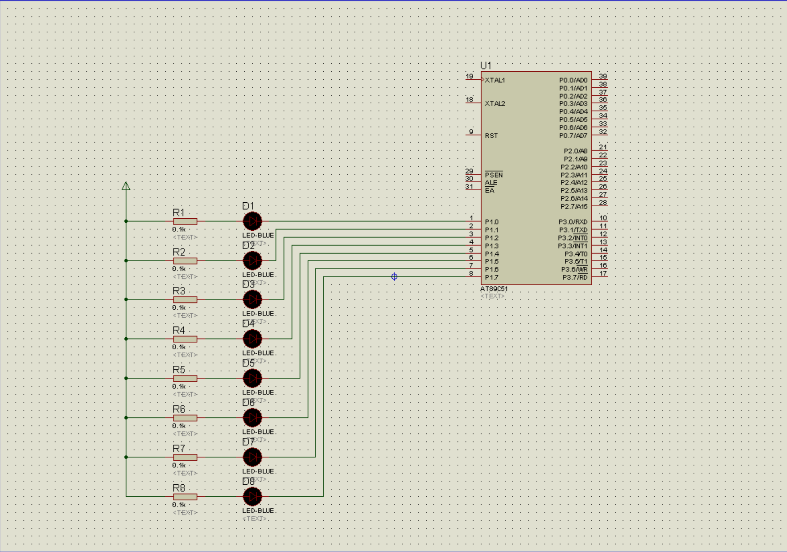

# 8051-MCU-Code-Samples
This is an undergraduate academic project in the field of automation, comprising a comprehensive collection of multiple 8051 microcontroller example programs.  
## 23_09_26

利用单片机控制一个8段LED数码管先猪环显示单个傌数：0、2、4、6、8，再显示单个奇数：1、3、5、7、9，如此反复循环显示。

## ISIS7

